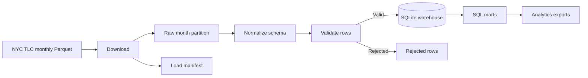

# NYC Taxi Data Pipeline

An incremental data pipeline for NYC TLC Yellow Taxi trip records.

I created this project to show a different part of data work from the migration engine. Here the problem is not mainly inconsistent client columns. It is handling a public dataset that is large enough to need partitions, repeatable monthly loads, schema changes, validation and an analytics layer on top of the raw files.

## What this project does



The live path downloads one official TLC month at a time, normalizes it into one canonical trip schema, rejects clearly invalid records, replaces that month in the warehouse and records the successful load in a manifest.

## Why I built it this way

I did not want the project to be a notebook that downloads a Parquet file and immediately creates charts.

The parts I wanted to make visible are the parts that normally matter once a pipeline has to keep running:

- monthly partitions
- idempotent loads
- schema evolution
- data-quality rules
- rejected-row reporting
- SQL marts
- source-to-output traceability

## Current TLC schema change handled

TLC added `cbd_congestion_fee` to Yellow, Green and High Volume FHV trip data from 2025 onward. The canonical schema includes the field, but older source files can still be normalized with a controlled zero default when the field does not exist.

## Warehouse

The portfolio version uses SQLite so the complete demo works without database-server setup.

Main fact table:

```text
fact_trip
```

Analytics views:

```text
mart_daily_kpis
mart_hourly_demand
mart_zone_performance
mart_route_performance
```

The SQL layer answers questions such as busiest hours, highest-volume pickup zones, route volume, average trip duration, average fare and daily congestion-fee totals.

## Installation

```bash
git clone https://github.com/ycailon/nyc-taxi-data-pipeline.git
cd nyc-taxi-data-pipeline
python -m venv .venv
```

Windows PowerShell:

```powershell
.venv\Scripts\Activate.ps1
```

Install:

```bash
pip install -e ".[dev]"
```

## Run the offline demo

```bash
taxi-pipeline demo --rows 500
```

This does not download TLC data. It generates taxi-shaped sample rows, intentionally introduces three invalid records, and runs the complete pipeline.

Expected default result:

```text
500 source rows
497 valid rows
3 rejected rows
497 warehouse rows
```

Outputs include:

```text
data/warehouse/taxi.db
output/rejected_2025_01.csv
output/summary_2025_01.json
output/marts/mart_daily_kpis.csv
output/marts/mart_hourly_demand.csv
output/marts/mart_zone_performance.csv
output/marts/mart_route_performance.csv
```

## Load a real TLC month

For example:

```bash
taxi-pipeline load --year 2026 --month 5
```

The pipeline downloads the official Yellow Taxi Parquet file and taxi-zone lookup, processes it, then records the completed month in:

```text
data/manifest.json
```

Running the same month again normally skips it:

```text
status: skipped
reason: already complete
```

To intentionally replace it:

```bash
taxi-pipeline load --year 2026 --month 5 --force
```

## Data quality

A row is rejected when the pipeline finds conditions such as:

- an invalid timestamp
- dropoff before pickup
- an implausibly long trip
- negative distance/fare/total
- an implausibly high total
- an invalid taxi-zone ID

I keep the rejected rows and the reason instead of silently filtering them out.

## Testing

```bash
pytest
```

The tests cover schema evolution, bad-row classification, manifest idempotency and the complete offline pipeline through the SQL marts.

## Source

The live source is NYC Taxi & Limousine Commission Trip Record Data. TLC publishes the files monthly in Parquet and notes that publication is typically delayed while vendor submissions are completed.

## Current limitations

- Yellow Taxi only in the first version
- monthly batch ingestion, not streaming
- SQLite instead of a distributed/cloud warehouse
- no orchestration service such as Airflow/Dagster yet
- no geographic map layer yet
- deterministic data-quality thresholds rather than anomaly detection

## Improvements I would add next

- Yellow + Green + FHV/HVFHV support behind one dataset interface
- Postgres/BigQuery/Snowflake target adapters
- dbt models and tests
- orchestration and scheduled backfills
- partition-level checksums
- late-arriving file detection
- geospatial analysis with taxi-zone geometry
- incremental dashboard refresh

## Portfolio note

The demo data is synthetic. Real trip data is downloaded from the public NYC TLC source only when the live command is run, and raw files are intentionally excluded from Git.
