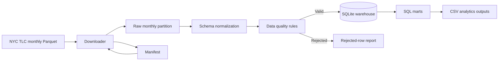

# Architecture

The live path keeps each TLC month as a separate raw Parquet file. A manifest records successfully processed months so a normal rerun does not download and load the same month again.
